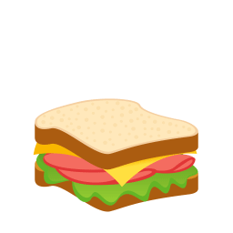

#  &nbsp;Hi there! I'm Alvi Hasan&nbsp; 

A full stack developer from Bangladesh. Strong experience in RESTful API Development, MERN, PERN, NodeJs, ExpressJs, NestJs, ReactJs, .NET Core, ASP.NET Framework, SQL(PostgreSQL, MSSQL, MySQL, MariaDB), NoSQL(MongoDB) AWS, Docker.  

And I love**cooking!**  

Feel free to connect with me. I'm also **available** at:  

&nbsp;&nbsp;&nbsp;&nbsp;&nbsp;&nbsp;

 
 

#  &nbsp;Used Languages

#  &nbsp;Streak

#  &nbsp;Stats

